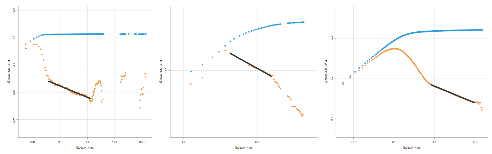

# Поиск бинарных признаков на данных диагностических графиков с определением их численных характеристик

## 1. Обзор

### Описание задачи

В процессе интерпретации данных по нефтяным и газовым скважинам одним из ключевых инструментов является **диагностический график**. Он строится на основе интервала данных давления, который выделяется из общего объёма замеров. На таком графике отображаются:

1. **$\Delta p$** — разница (изменение) давления относительно давления в начале интервала.
2. **$\mathrm{d}(\Delta p)/\mathrm{d}(\ln t)$** — производная $\Delta p$ по логарифму времени.

Детали построения диагностического графика можно изучить в **Приложении 1**.

С помощью визуального анализа диагностического графика интерпретатор может «на глаз» определить набор **бинарных признаков**, которые указывают на определённые режимы течения или особенности поведения скважины или пласта.

В данной работе мы рассмотрим следующие признаки:
- Некачественные данные (bq, bad quality)
- Влияние ствола скважины (wb, wellbore storage)
- Радиальный режим течения (ra, radial flow)
- Линейный режим течения (li, linear flow)
- Билинейный режим течения (bi, bilinear flow)
- Сферический режим течения (sp, spherical flow)
- Граница постоянного давления (pc, constant pressure boundary)
- Непроницаемые границы (im, impermeable boundary)

Каждый из этих признаков, кроме признака «некачественные данные», при наличии на графике, также имеет **численную характеристику** — некоторое значение, указывающее, где (или в какой момент времени) данный паттерн проявляется наиболее явно.

Вручную выявлять такие особенности для большого числа файлов трудоёмко и может быть субъективно. Поэтому в данной задаче требуется **автоматизировать** процесс поиска бинарных признаков и определять их ключевую численную характеристику.

### Ценность решения

1. **Ускорение рутинного анализа**: автоматизированный поиск признаков экономит время интерпретаторов и снижает вероятность ошибок.
2. **Единый стандарт качества**: уменьшение субъективного фактора при выделении паттернов.
3. **Основа для более сложных алгоритмов**: зная, какие признаки присутствуют, можно запускать алгоритмы дальнейшей интерпретации, строить модели и получать оценки параметров пласта и скважины.
4. **Подсказка для начинающих специалистов**: система «подсвечивает» важные детали, которые интерпретатор мог бы упустить.

---

## 2. Оценка качества

Задача делится на две подзадачи:
1. Определение бинарных признаков.
2. Определение численных коэффициентов признаков, если они были обнаружены.

При этом:
- **70%** итоговой оценки отводится на определение бинарного признака.
- **30%** — на определение численного коэффициента.

Условно, за один кейс можно максимум набрать **100 баллов**:  
- **70 баллов** за корректное распознавание бинарных признаков (есть или нет).  
- **30 баллов** за точность численных коэффициентов для тех признаков, которые были определены как присутствующие.

Всего существует **8 бинарных признаков**. Для каждого признака возможны четыре ситуации:
1. Признак правильно определён как присутствующий (верное определение).
2. Признак ошибочно определён как присутствующий (ложное определение).
3. Признак пропущен, хотя в разметке он есть.
4. Признак правильно определён как отсутствующий (верное отсутствие).

Баллы начисляются только за верное определение (случай 1) и верное отсутствие (случай 4). За ложное определение или пропуск признака баллы не начисляются.

### Оценка численных коэффициентов

Численные коэффициенты оцениваются только для тех признаков, которые в исходной разметке присутствуют. Если, например, в кейсе есть 2 признака (по разметке), то соответствующее число численных характеристик тоже равно 2, и тогда каждый коэффициент даёт равные доли от тех 30 баллов, которые отведены на численные характеристики. Если в кейсе признаков 4, то доля для каждого коэффициента уменьшается пропорционально.

Точность определения численных коэффициентов оценивается по **относительной ошибке** в пределах **10%**. Если значение алгоритма попадает в окно ±10% от эталонного, считается, что признак найден корректно. Если бинарный признак не был определён алгоритмом, а по разметке он есть, то за его численную характеристику автоматически начисляется **0 баллов**, так как признак считался отсутствующим.

---

## 3. Данные

### Источник и структура

Данные представляют собой набор **текстовых файлов** (по одному файлу на каждое исследование), лежащих в отдельной папке. Имена файлов — в формате UUID (например, `aa1db5db-aff4-4223-ac58-2f7a416dbab8`, без расширения). Всего в задаче будет рассматриваться около 45 000 кейсов.

Каждый файл содержит три колонки, разделённые табуляцией:

| Время (часы)    | $\Delta P$ (атм)               | $P'$ (атм) |
|-----------------|-----------------------------------|----------------------------------------------|
| 0.4300000001    | 0.8514491712                     | 1.2340512912                                 |
| 0.7633333335    | 0.9273745749                     | 0.9466079349                                 |
| 0.9299999999    | 2.1096415769                     | 0.5799567543                                 |
| 1.0966666667    | 2.5769443599                     | 2.2279489107                                 |
| 1.2016666666    | 2.0734866228                     | 0.0353141565                                 |
| ...             | ...                               | ...                                          |

> **Важно**: Для газовых скважин используется **псевдодавление**, имеет на порядок большие значения в абсолюте (напимер $10^6$ или больше), и это может показаться нефизичным, если считать, что это цифры описывающие давление. Однако на этот момент не стоит обращать внимания, поскольку принцип определения паттернов остаётся тем же. Такие данные будут попадаться редко, но все же будут.

### Разметка (пример)

В обучающем наборе имеется таблица CSV с разметкой, в которой на каждую строку (каждый файл) перечислены:

- Имена файла, департамента, пользователя, сделавшего разметку.
- 8 бинарных признаков (по одному столбцу на признак).
- Численные характеристики (по одному столбцу на каждый признак, кроме первого, у которого нет характеристики).

Пример (упрощённый формат):

| file                                   | department  | user  | bq | wb | ra | li | ... | wb_d        | ra_d         | ... |
|----------------------------------------|------------ |-------|----|----|----|----|-----|------------|------------- |-----|
| aa1db5db-aff4-4223-ac58-2f7a416dbab8   | department1 | user1 | 0  | 1  | 0  | 0  | ... | 2.346339924|             | ... |
| bb32f613-6dee-4d01-b697-34fbdb42e21a   | department1 | user1 | 0  | 1  | 0  | 1  | ... | 0.512683838| 0.318510896 | ... |
| 540c2722-5753-aa43-88f4-e41d9a115ea8   | department1 | user3 | 0  | 1  | 0  | 0  | ... | 1.401793512|             | ... |

- **Бинарный признак**: 0 или 1 (признак отсутствует или присутствует).
- **Численные характеристики**: если признак активен (1), то в соответствующем столбце хранится числовое значение, связанное с этим признаком (например, время, в которое он наблюдается).

Детали о том, как конкретно характеризуются признаки и что значат их численные характеристики, можно изучить в **Приложении 2**.

---

## 4. Постановка задачи и формат представления решений

Задача состоит из **двух связанных частей**:

1. **Классификация** (бинарная): для каждого из 8 признаков определить, присутствует ли он в анализируемом файле (0 или 1).
2. **Регрессия** (оценка численной характеристики): если признак присутствует (1), нужно вычислить численное значение, описывающее, где или в какой момент на графике он проявляется.

На вход алгоритм получает:
- **Файл** с тремя столбцами ($t$, $\Delta P$, $P'$).
- **Идентификатор** файла (UUID) в виде его имени.

На выходе он должен сгенерировать строку в итоговой CSV-таблице, содержащую:
- `file`: UUID файла (тот же, что и на входе).
- По одному столбцу для каждого бинарного признака (0/1).
- По одному столбцу для численной характеристики (если актуально для данного признака).

**Пример выходных данных** (CSV-таблица):

| file                                   | bq | wb | ra | li | ... | wb_d        | ra_d         | ... |
|----------------------------------------|----|----|----|----|-----|------------|------------- |-----|
| 540c2722-5753-aa43-88f4-e41d9a115ea8   | 0  | 1  | 0  | 0  | ... | 1.401793512|             | ... |

---

## 5. Дополнительные материалы

Для удобства участников предоставляются следующие приложения:
- **Приложение 1** – формирование диагностического графика.
- **Приложение 2** – описание бинарных признаков и их численных коэффициентов.
- **Приложение 3** – пример Python кода для создания просмотрщика данных.

# Приложение 1. Формирование диагностического графика

## 1. Базовая подготовка данных

При **построении диагностического графика** обычно требуется:
1. **Выделить** данные из общего массива по времени начала и конца интервала.
2. **Посчитать** функции  $\Delta P$ и  $\Delta t$ (по модулю), где для всех точек вычитаются давление и время, соответствующие **первой** точке заданного интервала:
   $$
   \Delta P_i = |P_i - P_0|, \quad
   \Delta t_i = |t_i - t_0|.
   $$

3. **Вычислить производную**  $\Delta P$ по логарифму времени (часто обозначаемую как $\frac{d(\Delta P)}{d(\ln t)}$) по центральной разности:
   $$
   P'_i \approx \frac{\Delta P_{i+1} - \Delta P_{i-1}}{\ln(\Delta t_{i+1}) - \ln(\Delta t_{i-1})}.
   $$

Однако в рамках данной задачи данные в файлах **уже подготовлены** и посчитаны; достаточно просто нанести их на двойной логарифмический график.

---

## 2. Построение диагностического графика

Чтобы построить диагностический график, нужно воспользоваться **двойными логарифмическими** осями и отобразить 2 серии:
-  $\Delta P$ - функция давления,
-  $P'$ (или  $\frac{d(\Delta P)}{d(\ln t)}$) - производная функции давления,

которые находятся в исходном файле с данными.

При этом важно сохранять **единую цену деления** по осям, чтобы не потерять визуальные диагностические признаки.

---

## 3. Самостоятельный расчет производной

Некоторые данные могут показаться слишком шумными, и возможно возникнет желание сгладить эти данные самостоятельно, в том числе заново рассчитав производную.

Для таких случаев хорошо подойдет **оконное сглаживание**. При построении диагностического графика обычно используют сглаживание с окном в пределах 0.5 лог-цикла (коэффициент сглаживания до 0.5). Значения выше 0.5 могут вносить уже значительные искажения в диагностические признаки.

Однако следует понимать, что имеющаяся в оригинальных данных производная была рассчитана более точным методом — с использованием функции **суперпозиции времени** (Superposition Time). Её применяют, чтобы исключить искажения, связанные с переменной работой скважины. Ниже приведено уравнение такой функции, но в контексте данной задачи вычислить её **не представляется возможным**, так как отсутствуют полные данные о режиме работы скважины до момента записи диагностического графика.

В большинстве случаев упрощённый метод расчёта не даёт заметных искажений диагностического графика, однако в некоторых ситуациях искажения могут быть существенными и сильно влиять на диагностические признаки.

---

## 4. Математическая формулировка функции времени суперпозиции

Пусть есть список дебитов $q_i$ (Rate) и момент времени, в котором мы рассчитываем функцию, — $t$. Тогда величина $S_n(t)$ (суперпозиционное время) вычисляется по формуле:

$$
S_n(t) = \ln(t) + \sum_{i=1}^{N-1} \frac{(q_i - q_{i-1}) \ln(t + t_N - t_i)}{q_N}.
$$

Здесь:
- $q_i$ — расход (дебит) в момент времени $t_i$ (из списка Rate),
- $t_i$ — время изменения дебита,
- $t_N$ — время последнего изменения дебита (момент начала текущего режима),
- $N$ — общее количество изменений дебита,
- $t$ — текущее время, для которого рассчитывается суперпозиционное время.

Важно отметить, что в рамках данной задачи **будет невозможно вычислить** суперпозиционное время, так как отсутствуют полные данные о временных режимах работы скважины.

---

## 5. Пример кода

Ниже приведён пример на **Python**, демонстрирующий основные шаги построения диагностического графика по оригинальным данным.

```python
import numpy as np
import matplotlib.pyplot as plt
import tkinter as tk
from tkinter import filedialog
from matplotlib.backends.backend_tkagg import FigureCanvasTkAgg


class LogPlotApp:
    def __init__(self, root):
        self.root = root
        self.root.title("График давления и производной")

        # Кнопка выбора файла
        self.btn_open = tk.Button(root, text="Открыть файл", command=self.load_file)
        self.btn_open.pack()

        # Создаем область для графика
        self.fig, self.ax = plt.subplots(figsize=(6, 5))
        self.canvas = FigureCanvasTkAgg(self.fig, master=root)
        self.canvas.get_tk_widget().pack()

    def load_file(self):
        """Открывает диалог выбора файла и загружает данные"""
        file_path = filedialog.askopenfilename(filetypes=[("All files", "*.*")])
        if not file_path:
            return

        # Читаем данные из файла
        data = np.loadtxt(file_path)
        time = data[:, 0]  # Время (часы)
        pressure = data[:, 1]  # Давление (атм)
        derivative = data[:, 2]  # Производная давления (атм)

        # Очищаем старый график
        self.ax.clear()

        # Строим точки
        self.ax.loglog(time, pressure, 'o', label='Давление')
        self.ax.loglog(time, derivative, 's', label='Производная давления')

        # Устанавливаем одинаковую цену делений осей X и Y
        self.ax.set_aspect('equal')

        # Подписи
        self.ax.set_xlabel("Время (часы)")
        self.ax.set_ylabel("Давление и производная (атм)")
        self.ax.set_title("График давления и производной во времени")
        self.ax.legend()
        self.ax.grid(True, which='both', linestyle='--', linewidth=0.5)

        # Обновляем холст
        self.canvas.draw()


# Создаем главное окно
root = tk.Tk()
app = LogPlotApp(root)
root.mainloop()
```

# Приложение 2. Описание бинарных признаков и их численных коэффициентов

В рамках данной задачи выделяются 8 бинарных признаков, характерных для поведения нефтяных и газовых скважин на диагностическом графике:

1. **Некачественные данные (bq, bad quality)**  
2. **Влияние ствола скважины (wb, wellbore storage)**  
3. **Радиальный режим течения (ra, radial flow)**  
4. **Линейный режим течения (li, linear flow)**  
5. **Билинейный режим течения (bi, bilinear flow)**  
6. **Сферический режим течения (sp, spherical flow)**  
7. **Граница постоянного давления (pc, constant pressure boundary)**  
8. **Непроницаемые границы (im, impermeable boundary)**  

Ниже приводятся общие особенности «качественного» (или «типичного») диагностического графика, а затем более детально описываются указанные признаки, а также приводится информация об их численных характеристиках.

---

## 1. Общие свойства качественного диагностического графика

1. **Рост функции $\Delta P$**  
   При корректном построении графика $ \Delta P $ (разница давлений) обычно плавно возрастает по мере увеличения времени.  
2. **Отсутствие резких изменений**  
   График $ \Delta P $ не должен содержать больших скачков, провалов или аномального «шума» в центральной части.  
3. **Завершение**  
   По мере окончания исследования кривая $ \Delta P $ может либо выходить в плато (константу), либо продолжать плавный рост.  

**Три основные области**  
На классическом (идеальном) диагностическом графике условно можно выделить три последовательные области:  
- **Область влияния ствола скважины (1)**  
  Наблюдается исключительно в самом начале исследования. Характеризуется монотонным ростом как функции давления, так и производной, с коэффициентом наклона 1. Зачастую на графике этот процесс может сопровождаться «горбом» производной $P'$, что связано с переходом на другой режим.  
- **Область работы пласта (2)**  
  Здесь могут проявляться различные режимы течения (радиальный, линейный, билинейный, сферический) в зависимости от физической модели пласта и скважины. Эти режимы, как правило, различаются постоянным (или почти постоянным) углом наклона на логарифмическом графике и должны длиться не менее 0.5 логарифмического цикла времени, чтобы считаться уверенно идентифицированными.  
- **Область влияния границ (3)**  
  В конце исследования могут проявляться границы. Они характеризуются тем, что производная либо начинает «проваливаться» и стремиться к 0 (граница постоянного давления), либо, наоборот, начинает расти с коэффициентом наклона, стремящимся к 1.  


Последовательность перехода областей всегда **строгая**:  
1. Сначала может идти влияние ствола (**wb**, если оно проявляется).  
2. Затем основной режим (или несколько режимов) работы пласта — **ra**, **li**, **bi**, **sp**.  
3. В самом конце — признаки границ: **pc** или **im**.  

Также возможны случаи, когда какие-то области не проявляются или пропускаются (например, нет влияния ствола, или не успели «дождаться» границ и т. д.).

---

## 2. Описание признаков и их численных характеристик

Ниже перечислены все восемь бинарных признаков, которые требуется автоматически определять (0 или 1), а также приводится дополнительная информация по каждому из них. У семи признаков (кроме «bq») имеется **численная характеристика**.

### 2.1. Некачественные данные (bq, bad quality)

**Суть и признаки на графике**  
«Некачественные данные» — это общий признак, указывающий на то, что данные могут быть шумными, содержать пропуски, аномальные скачки или другие артефакты, затрудняющие достоверное определение режимов. Примеры ситуаций:  
- Слишком большие пропуски данных на ключевых интервалах.  
- Сильный шум или некорректная первая точка (приводит к искажённой производной).  
- Наличие дополнительных переходных процессов (смена режимов работы скважины) со скачкообразными изменениями на графиках $\Delta P$ и $P'$.  
- Низкая дискретность измерений и «ступенчатый» вид $\Delta P$, не позволяющий определить стабильные наклоны.
- Зашумление данных по давлению, которое может быть вызвано различными техногенными признаками.
- Случайный выбор временного интервала, не отражающего реальное давление на исследуемой стадии (фактически «мусорные» данные).  

**Особенности**  
- Сам по себе признак «bq» не отменяет наличие других признаков. Возможны ситуации, когда часть данных зашумлена, но другая часть содержит четко видимые режимы.  
- У «bq» **нет** численной характеристики, поэтому если он равен 1, в результирующей таблице не требуется дополнительное значение.


*Слева-направо - пропуски данных, некорректная первая точка, лишние данные в области выделения*


*Слева-направо - низкая дискретность, шум в данных, случайные данныйе в области выделения*

---

### 2.2. Влияние ствола скважины (wb, wellbore storage)

**Описание и физическая природа:**  
- После остановки на устье приток на глубине продолжается из-за сжимаемости жидкости или подъема её уровня в скважине. Со временем этот эффект исчезает, и начинает проявляться работа пласта. 
- В результате на ранних временах давление меняется линейно от времени, а производная (в логарифмическом масштабе) образует участок с наклоном $ k = 1 $.

**Основные особенности наблюдения:**  
- Возникает **исключительно в самом начале** анализа (ранние времена).  
- Самый частый признак, присутствует почти в каждом исследовании.  
- Является «вредным» режимом и «скрывает» последующие (радиальный, линейный и т.д.).  

**Численные параметры:**  
- Наклон аппроксимирующей прямой(коэффициент $ k $) равен $1$.  
- Коэффициент $ b $ аппроксимирующей прямой, характеризует физический коэффициент влияния ствола скважины. В рамках этой задачи именно этот коэффициент требуется определить 

**Практическое использование:**  
- Позволяет планировать время остановки скважины: заранее известно, когда закончится «мешающий» участок ВСС и начнётся полезный режим.  
- В остальном считается «вредным» режимом, так как не даёт информации о пласте, лишь о свойствах поведения жидкости в стволе скважины.


---

### 3. Радиальный режим течения (ra, radial flow)

**Описание и физическая природа:**  
- Классический режим, при котором поток к стволу идёт равномерно (радиально) по всей окружности.  
- В уравнениях фильтрации для радиального потока давление зависит от логарифма времени, что приводит к горизонтальному участку производной ($ k = 0 $).
- Второй по распространенности режим течения после влияния ствола скважины.

**Основные особенности наблюдения:**  
- Графически на производной (в логарифмических координатах) видна горизонтальная линия (угол наклона 0).  
- Чтобы уверенно сказать, что это радиальный режим, он должен занимать не менее **0.5 логарифмических циклов**.  
- Чаще всего появляется в «середине» графика (между влиянием ствола и граничными эффектами) либо в самом конце, если границ на графике не наблюдается. Реже — в начале, если ВСС невелик или отсутствует.

**Численные параметры:**  
- Наклон $ k = 0 $.  
- Коэффициент $ b $ - позиция прямой по вертикали, искомый коэффициент при определении бинарного признака, на его основе можно рассчитать коэффициенты проницаемости и скин-фактора.

**Практическая ценность:**  
- Без обнаружения радиального режима точная интерпретация свойств пласта затруднена. Обычно исследования скважин проводят только для того, чтобы выявить именно радиальный режим и определить на его основе основные характеристики пласта и скважины. Поэтому он встречается настолько часто на диагностических графиках.


---

### 4. Линейный режим течения (li, linear flow)

**Описание и физическая природа:**  
- Характерен для притока к скважине с трещиной или горизонтальному стволу, где флюид может двигаться по одной линейной траектории.  
- В уравнении фильтрации зависимость давления и производной идёт по закону $\sqrt{t}$, что на логарифмическом графике даёт наклон $ k = 0.5 $.

**Особенности наблюдения:**  
- Функция $\Delta p$ и ее производная имеют одинаковый коэффициент наклона $ k = 0.5 $.  
- Должен наблюдаться не менее **0.5 логарифмического цикла**.  
- Часто предшествует радиальному режиму. Может «идти вместе» с билинейным режимом.  
- Встречается реже, чем радиальный.

**Численные параметры:**  
- Наклон $ k = 0.5 $.  
- Коэффициент $ b $ (позиция прямой по вертикали) - искомый коэффициент при обнаружении бинарного признака.

**Практическая ценность:**  
- Позволяет судить о геометрии трещины, если речь идет о скважине с трещиной.  
- Также позволяет судить о длине горизонтального участка, реально участвующего в работе, если говорить про горизонтальную скважину.


---

### 5. Билинейный режим течения (bl, bilinear flow)

**Описание и физическая природа:**  
- Характерен для скважин с трещинами низкой проводимости, когда флюид движется одновременно в 2 направлениях - линейно из пласта к трещине, и линейно в трещине от краёв непосредственно к самой скважине. 
- В уравнении фильтрации зависимость давления и производной идёт по закону $\sqrt[4]{t}$, что на логарифмическом графике даёт наклон $ k = 0.25 $.  

**Особенности наблюдения:**  
- Функция $\Delta p$ и её производная имеют одинаковый коэффициент наклона $ k = 0.25 $.  
- Должен наблюдаться не менее **0.5 логарифмического цикла**.  
- **Всегда** предшествует радиальному режиму.  
- Может идти одновременно с линейным режимом.  
- Встречается примерно так же часто, как линейный режим, но, возможно, немного реже.  

**Численные параметры:**  
- Наклон $ k = 0.25 $.  
- Коэффициент $ b $ (позиция прямой по вертикали) – искомый параметр при обнаружении бинарного признака.  

**Практическая ценность:**  
- Позволяет оценить проводимость трещины, что особенно важно для скважин с трещинами низкой проводимости.


---

### 6. Сферический режим течения (sp, spherical flow)

**Описание и физическая природа:**  
- Возникает при частичном вскрытии пласта вертикальной скважиной, когда поток флюида распространяется не радиально, а сферически (в трёхмерном объёме).  
- Характеризуется наклонной линией на графике производной с коэффициентом наклона $ k = -0.5 $.  
- Этот наклон обусловлен уравнением фильтрации: производная давления обратно пропорциональна корню из времени, что определяет характерное поведение на диагностических графиках.   

**Особенности наблюдения:**  
- Часто путается с переходным участком после влияния ствола скважины, где может появляться «горб» на графике производной.  
- Для достоверной идентификации режим должен наблюдаться не менее **0.5 логарифмического цикла**.  
- **Как правило, предшествует радиальному режиму.**  
- Встречается редко, так как требует особых условий: специфической конструкции скважины или ограниченного вскрытия продуктивного пласта.  

**Численные параметры:**  
- Наклон $ k = -0.5 $.  
- Коэффициент $ b $ (вертикальное положение прямой) – искомый параметр при обнаружении бинарного признака.

**Практическая ценность:**  
- Характерен для вертикальных скважин с частичным вскрытием продуктивного пласта или с неработающей частью перфорации.  
- Позволяет определить **эффективную длину перфорации** и оценить **анизотропию пласта** (разницу между вертикальной и радиальной проницаемостью).



---

### 7. Граница постоянного давления (pc, constant pressure boundary)  

**Описание и физическая природа:**  
- Этот режим всегда наблюдается **в конце исследования** и не может появиться в середине, так как после него в принципе не бывает других режимов.  
- В этом состоянии функция давления выходит на постоянное значение, а её производная стремится к нулю.  
- Такое поведение характерно для случаев, когда на скважину оказывает влияние соседняя скважина обратного действия, либо когда она достигает границы водоносного горизонта.  

**Особенности наблюдения:**  
- **Всегда** возникает в конце анализа.  
- Не имеет характерного угла наклона, проявляется как падение производной в конце графика.  
- Может выражаться резким снижением или более плавным падением, но не плавнее, чем наклон $ k = -1 $.  

**Численные параметры:**  
- Численный коэффициент – **время начала проявления эффекта** (в часах).  

**Практическая ценность:**  
- Дает информацию о **строении пласта** и **влиянии соседних скважин**.  
- Несмотря на это, в большинстве случаев считается **«вредным» эффектом**, так как **скрывает работу пласта**, ради которой проводится исследование.  


---

### 8. Непроницаемая граница (ib, impermeable boundary)  

**Описание и физическая природа:**  
- Этот режим **всегда** наблюдается **в конце исследования**.  
- Проявляется в виде роста производной, которая в конечном итоге выходит на линию с наклоном $ k = 1 $.  
- Как правило, исследование прекращают, когда этот эффект начинает проявляться, так как он несёт мало полезной информации. Поэтому **полностью сформировавшийся режим непроницаемой границы** с устойчивым наклоном $ k = 1 $ встречается редко.  
- Такое поведение может быть обусловлено либо работой соседних скважин с аналогичным характером течения, либо достижением физически непроницаемых границ пласта.  

**Особенности наблюдения:**  
- **Всегда** возникает в конце анализа.  
- Не имеет характерного угла наклона, проявляется как рост производной в конце графика.  
- Может выражаться плавным повышением производной с постепенным увеличением коэффициента наклона, но не превышает $ k = 1 $.  

**Численные параметры:**  
- Основной численный коэффициент – **время начала проявления эффекта** (в часах).  

**Практическая ценность:**  
- Позволяет определить **расстояние до границы**, а также прогнозировать момент её проявления при следующих исследованиях.  
- **Несёт немного больше полезной информации, чем влияние ствола скважины (ВСС)**, так как даёт сведения о **строении пласта** и **влиянии границ**.  
- Однако в целом считается **«вредным» режимом**, так как в большинстве случаев вызывается **работой соседних скважин** и **скрывает работу пласта**, ради которой проводится исследование.  


---

## 3. Общие рекомендации по интерпретации

1. **Последовательность признаков**  
   - Режим **влияния ствола (wb)** может проявиться только в начале.  
   - Затем идут основные типы течений (ra, li, bi, sp). Могут встретиться один или несколько по порядку.  
   - В конце графика могут появиться границы (pc или im).  

2. **Требуемая длительность режима**  
   - Чтобы уверенно считать, что тот или иной режим (ra, li, bi, sp) присутствует, участок должен длиться не менее **0.5** логарифмического цикла.  
   - Исключение — «границы» (pc и im), которые иногда успевают проявиться очень коротко.  

3. **Общая оценка качества данных**  
   - Если данные содержат пропуски, аномальный шум или некорректный интервал, следует ставить признак «bq = 1». При этом другие признаки могут быть расценены как присутствующие (если видны чёткие участки).

Таким образом, анализ диагностического графика сводится к пошаговой проверке участков на соответствие «стандартным» наклонам (wb, ra, li, bi, sp), а также к поиску признаков границ (pc, im). При выявлении режима следует рассчитывать его численный коэффициент $b$ (в случаях с фиксированным $k$) либо момент времени (для граничных эффектов). Признак «bq» при этом носит скорее «информацонный» характер и не имеет отдельной численной характеристики.

# Приложение 3 – Пример Python кода для создания просмотрщика данных.

Ниже приведён пример кода, демонстрирующего, как можно создать простое графическое приложение на базе `tkinter` для просмотра данных и их разметки.

```python
import math
import tkinter as tk
from tkinter import filedialog
import pandas as pd
import matplotlib.pyplot as plt
from matplotlib.backends.backend_tkagg import FigureCanvasTkAgg
import os
import numpy as np


class CSVViewer:

    def __init__(self, root):
        self.root = root
        self.root.title("CSV Viewer and Graph Plotter")

        # Индекс текущей строки в DataFrame
        self.current_row = 0
        # Основной DataFrame (после чтения CSV)
        self.data = None
        # Директория, где будут храниться текстовые файлы (с UUID именами)
        self.data_dir = None

        # Инициализация пользовательского интерфейса
        self.init_ui()

    def init_ui(self):
        self.frame = tk.Frame(self.root)
        self.frame.pack(fill=tk.BOTH, expand=True)

        # Фрейм для области с графиком
        self.canvas_frame = tk.Frame(self.frame)
        self.canvas_frame.pack(fill=tk.BOTH, expand=True)

        # Создаем фигуру matplotlib и холст, встраиваем их в интерфейс
        self.figure, self.ax = plt.subplots(figsize=(6, 6))
        self.canvas = FigureCanvasTkAgg(self.figure, master=self.canvas_frame)
        self.canvas_widget = self.canvas.get_tk_widget()
        self.canvas_widget.pack(fill=tk.BOTH, expand=True)

        # Фрейм для кнопок управления
        self.controls_frame = tk.Frame(self.frame)
        self.controls_frame.pack()

        self.prev_button = tk.Button(self.controls_frame, text="< Previous", command=self.show_previous_row)
        self.prev_button.grid(row=0, column=0)
        self.next_button = tk.Button(self.controls_frame, text="Next >", command=self.show_next_row)
        self.next_button.grid(row=0, column=1)
        self.open_button = tk.Button(self.controls_frame, text="Open CSV", command=self.open_csv)
        self.open_button.grid(row=0, column=2)

    def open_csv(self):
        file_path = filedialog.askopenfilename(filetypes=[("CSV Files", "*.csv")])
        if not file_path:
            return

        try:
            # Считаем CSV-файл. Важно подставить правильную кодировку и разделитель.
            self.data = pd.read_csv(file_path, sep=';', encoding='windows-1251')

            # Определяем директорию "data", где будут лежать файлы с именами UUID
            self.data_dir = os.path.join(os.path.dirname(file_path), "data")

            # Сбрасываем индекс текущей строки
            self.current_row = 0

            # Отображаем данные по первой строке
            self.show_current_row()
        except Exception as e:
            print(f"Error loading file: {e}")

    def load_data_file(self, uuid):
        """
        Загружает содержимое файла с данными на основе UUID (имени файла).
        Предполагается, что файлы лежат в self.data_dir.
        Возвращает текст (str) или None, если не удалось прочитать.
        """
        if not self.data_dir:
            return None

        file_path = os.path.join(self.data_dir, uuid)
        if not os.path.exists(file_path):
            return None

        try:
            with open(file_path, 'r', encoding='utf-8') as file:
                content = file.read()
            return content
        except Exception as e:
            return None

    def show_current_row(self):
        if self.data is not None and not self.data.empty:
            # Получаем UUID из первой колонки (0-й индекс) текущей строки
            uuid = self.data.iloc[self.current_row, 0]
            file_content = self.load_data_file(uuid)

            if file_content is not None:
                try:
                    # Разделяем файл с данными построчно и по табуляции
                    rows = [line.split('\t') for line in file_content.strip().split('\n')]
                    data = pd.DataFrame(rows, columns=['x', 'y1', 'y2'], dtype=float)

                    # Очищаем предыдущий график
                    self.ax.clear()

                    # Строим точки y1 и y2 на логарифмических осях
                    self.ax.loglog(data['x'], data['y1'], 'o', label='Series 1')
                    self.ax.loglog(data['x'], data['y2'], 'o', label='Series 2')

                    # Рисуем линии признаков течения вида y = 10^(k*log10(x) + b)
                    # k_values = {колонка в CSV: k-коэффициент}
                    # смысл k-коэффициентов и их привязка к признакам обозначена в приложении 2
                    k_values = {11: 1, 12: 0, 13: 0.5, 14: 0.25, 15: -0.5}
                    colors = ['green', 'red', 'blue', 'purple', 'orange']
                    x_range = data['x'].astype(float)

                    for (col, k), color in zip(k_values.items(), colors):
                        # Проверяем, чтобы колонка col не выходила за границы df
                        if col < len(self.data.columns):
                            b_value = self.data.iloc[self.current_row, col]
                            # Если в CSV есть валидное число, используем его
                            if pd.notna(b_value):
                                b_value = float(b_value)
                                # Формируем массив y_line
                                y_line = 10 ** (k * np.log10(x_range) + b_value)
                                self.ax.plot(x_range, y_line, label=f'Line (k={k}, b={b_value})', color=color)

                    # Вертикальные (пунктирные) линии по определённым колонкам
                    for col, label, color in zip([16, 17], ["P constant", "Impermeable"], ["blue", "red"]):
                        if col < len(self.data.columns):
                            x_value = self.data.iloc[self.current_row, col]
                            if pd.notna(x_value):
                                x_value = float(x_value)
                                y_min, y_max = data[['y1', 'y2']].min().min(), data[['y1', 'y2']].max().max()
                                self.ax.vlines(x=x_value,
                                               ymin=y_min,
                                               ymax=y_max,
                                               linestyles='dashed',
                                               color=color,
                                               label=f'{label} (x={x_value})')

                    # Настройки заголовков и легенды
                    self.ax.set_title(f"Data for UUID: {uuid}")
                    self.ax.set_xlabel("X (log scale)")
                    self.ax.set_ylabel("Y (log scale)")
                    self.ax.set_aspect('equal', adjustable='datalim')
                    self.ax.legend()

                    # Отрисовываем график на холсте
                    if self.canvas:
                        self.canvas.draw()
                    else:
                        raise AttributeError("Canvas object is not initialized.")
                except Exception as e:
                    print(f"Error plotting data for row {self.current_row}: {e}")

    def show_previous_row(self):
        if self.data is not None and self.current_row > 0:
            self.current_row -= 1
            self.show_current_row()

    def show_next_row(self):
        if self.data is not None and self.current_row < len(self.data) - 1:
            self.current_row += 1
            self.show_current_row()


if __name__ == "__main__":
    root = tk.Tk()
    app = CSVViewer(root)
    root.mainloop()
```